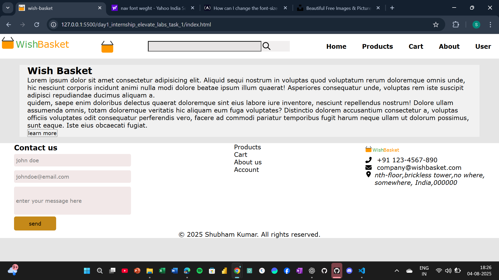
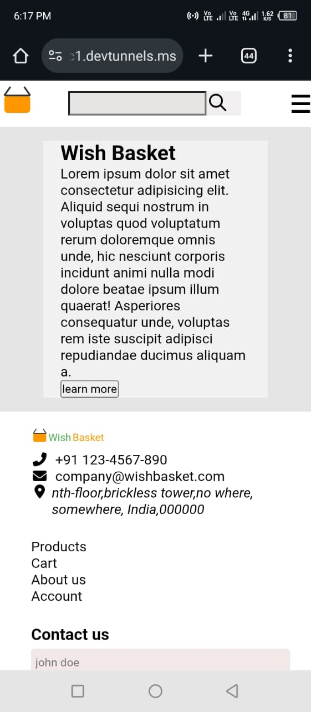

# 🎁 Wish Basket

**Wish Basket** is a user-friendly e-commerce web application built as part of my internship at **Elevate Labs**. The platform is designed to deliver thoughtful gifts and delightful surprises for special occasions like birthdays, anniversaries, and other memorable milestones.

---

## ✨ Features

- **Responsive Design** – Seamlessly adapts to various screen sizes, from mobile to desktop.
- **Modular Navigation** – Provides intuitive links to different sections of the web app.
- **Occasion-Focused** – Curated experience for celebrations and gifting moments.
- **Scalable Layout** – Designed for future expansion with features like personalization, payment integration, and user accounts.

---

## 📌 Tech Stack

- HTML5, CSS3

---

## 📸 Screenshots

  
 ---
  
 ---
  

---

## 🛠️ Status

🚧 Currently under active development.

---

## 📬 Contact

Feel free to reach out with feedback or collaboration ideas:

**Shubham Kumar**  
📧 shubbhammkumarr@outlook.com  
🔗 [LinkedIn](https://www.linkedin.com/in/shubham-kumar-b9b6b2241)  
🔗 [GitHub](https://github.com/SHUBBHAM-KUMARR)
